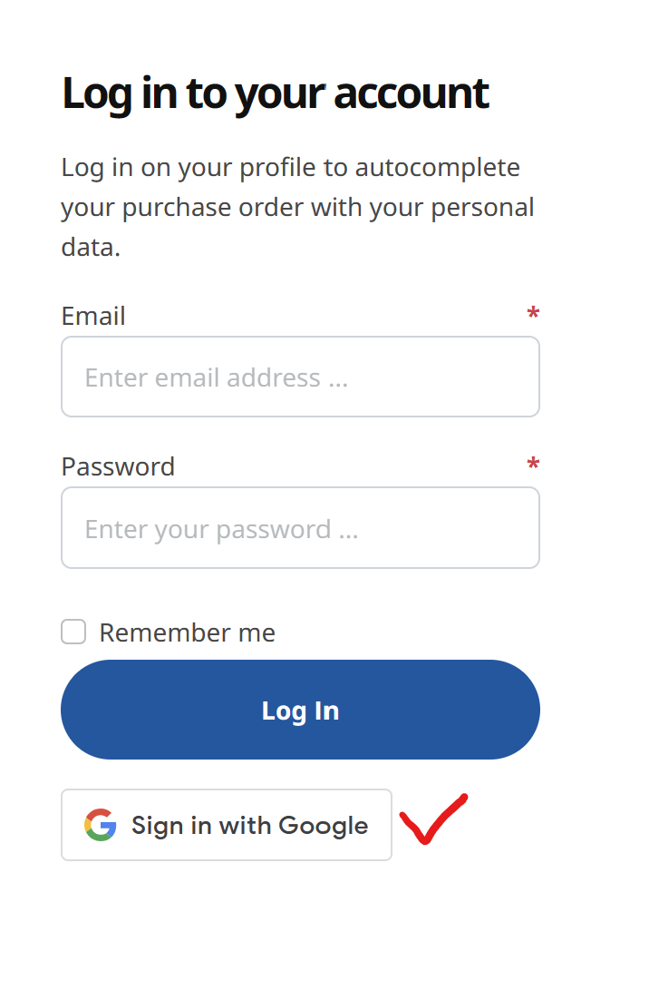
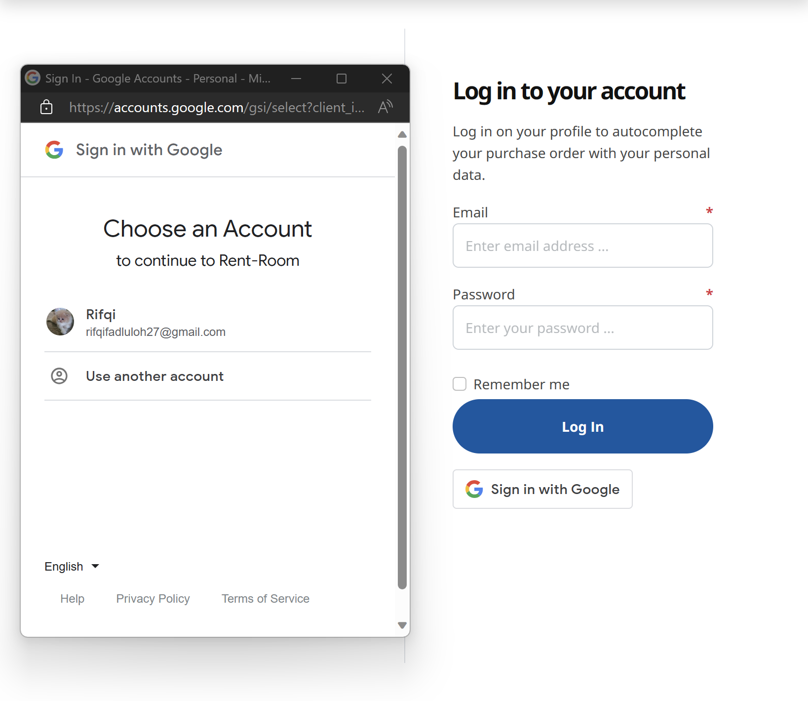

# 🚀 Get started here

RESTful API CRUD operations (GET, POST, PUT, PATCH, DELETE)

# 🔖 RESTful endpoint

### Send requests

RESTful APIs allow you to perform CRUD (Create, Read, Update, and Delete) operations using the POST, GET, PUT, PATCH and DELETE HTTP methods.

### View responses

- Observe the response tab for status code (200 OK), response time, and size.

```js
[
    ...,
    {
    name: string,
    facility: string,
    roomCapacity: integer,
    imageUrl: string,
    authorId: integer,
    location: string,
    price: integer,
    typeId: integer,
    updatedAt: date,
    createdAt: date
    },
    "..."
]

```

- Observe the response tab for status code (201 Created), response time, and size.

```js
{
    name: string,
    facility: string,
    roomCapacity: integer,
    imageUrl: string,
    authorId: integer,
    location: string,
    price: integer,
    typeId: integer,
    updatedAt: date,
    createdAt: date
}

```

- Observe the response tab for status code (400 Bad Request), response time, and size.

```js
{
  message: [
    "name cannot be empty",
    "facility cannot be empty",
    "roomCapacity cannot be empty",
    "imageUrl cannot be empty",
    "authorId cannot be empty",
    "location cannot be empty",
    "price cannot be empty",
    "typeId cannot be empty",
  ];
}
```

- Observe the response tab for status code (401 Not Authorized), response time, and size.

```js
{
  message: "Invalid Token";
}
```

- Observe the response tab for status code (403 Forbidden), response time, and size.

```js
{
  message: "Forbidden";
}
```

- Observe the response tab for status code (500 Internal server error), response time, and size.

```js
{
  message: "Internal server error";
}
```

### GET /Lodging

**Read data**: Send a GET request to `http://localhost:3000/lodgings`.

- **Request :**

```json
"headers" : {
    "access_token": "string"
}
```

- **Response :**

```json
[
    {
        "id": 1,
        "name": "Cozy Studio Apartment",
        "facility": "Wi-Fi, Kitchen, Free Parking",
        "roomCapacity": 2,
        "imageUrl": "https://a0.muscache.com/im/pictures/826206b8-3894-4992-8213-4c9a10a75b0e.jpg?im_w=1440",
        "authorId": 1,
        "location": "New York City, NY",
        "price": 6234092,
        "typeId": 1,
        "status": "Active",
        "createdAt": "2023-10-18T15:06:07.578Z",
        "updatedAt": "2023-10-18T15:06:07.578Z",
        "User": {
            "id": 1,
            "username": "admin",
            "email": "admin@email.com",
            "password": "$2b$10$k3u/L1yydo5KJa.T671QLO/8m5HXx1IuLUMzIkJ8ekZ5SYQ2BF.RK",
            "role": "Admin",
            "phoneNumber": "0215432",
            "address": "Jakarta",
            "createdAt": "2023-10-18T15:06:07.562Z",
            "updatedAt": "2023-10-18T15:06:07.562Z"
        }
    },
    "..."
]
```

### GET /Lodging/:id

**find lodging by id to get data**: Send a GET request to `http://localhost:3000/lodgings/:id`.

- **Request :**

```json
"headers" : {
    "access_token": "string"
}
```

- **Response :**

```json
{
  "id": 1,
  "name": "Cozy Studio Apartment",
  "facility": "Wi-Fi, Kitchen, Free Parking",
  "roomCapacity": 2,
  "imageUrl": "https://a0.muscache.com/im/pictures/826206b8-3894-4992-8213-4c9a10a75b0e.jpg?im_w=1440",
  "authorId": 1,
  "location": "New York City, NY",
  "price": 6234092,
  "typeId": 1,
  "status": "Active",
  "createdAt": "2023-10-18T15:06:07.578Z",
  "updatedAt": "2023-10-18T15:06:07.578Z"
}
```

### POST /Lodging

**Add/Create new data**: Send a POST request to `http://localhost:3000/lodgings`.

- **Request :**

```json
{
  "name": "string",
  "facility": "string",
  "roomCapacity": "integer",
  "imageUrl": "string",
  "location": "string",
  "price": "integer",
  "typeId": "integer",
  "status": "string"
}
```

```json
"headers" : {
    "access_token": "string"
}
```

- **Response :**

```json
{
  "id": 1,
  "name": "Cozy Studio Apartment",
  "facility": "Wi-Fi, Kitchen, Free Parking",
  "roomCapacity": 2,
  "imageUrl": "https://a0.muscache.com/im/pictures/826206b8-3894-4992-8213-4c9a10a75b0e.jpg?im_w=1440",
  "authorId": 1,
  "location": "New York City, NY",
  "price": 6234092,
  "typeId": 1,
  "status": "Active",
  "createdAt": "2023-10-18T15:06:07.578Z",
  "updatedAt": "2023-10-18T15:06:07.578Z"
}
```

### PUT /Lodgings/:id/edit

**Modify data lodging**: Send a PUT request to `http://localhost:3000/lodgings/:id/edit`.

- **Request :**

```json
{
  "name": "string",
  "facility": "string",
  "roomCapacity": "integer",
  "imageUrl": "string",
  "location": "string",
  "price": "integer",
  "typeId": "integer",
  "status": "string"
}
```

```json
"headers" : {
    "access_token": "string"
}
```

- **Response :**

```json
{
  "id": 1,
  "name": "Cozy Studio Apartment",
  "facility": "Wi-Fi, Kitchen, Free Parking",
  "roomCapacity": 4,
  "imageUrl": "https://a0.muscache.com/im/pictures/826206b8-3894-4992-8213-4c9a10a75b0e.jpg?im_w=1440",
  "authorId": 1,
  "location": "New York City, NY",
  "price": 6234092,
  "typeId": 1,
  "status": "Active",
  "createdAt": "2023-10-18T15:06:07.578Z",
  "updatedAt": "2023-10-18T15:06:07.578Z"
}
```

### PATCH /Lodgings/:id/status

**Modify status lodging**: Send a PATCH request to `http://localhost:3000/lodgings/:id/status`.

- **Request :**

```json
{
  "status": "string"
}
```

```json
"headers" : {
    "access_token": "string"
}
```

- **Response :**

```json
{
  "id": 1,
  "name": "Cozy Studio Apartment",
  "facility": "Wi-Fi, Kitchen, Free Parking",
  "roomCapacity": 2,
  "imageUrl": "https://a0.muscache.com/im/pictures/826206b8-3894-4992-8213-4c9a10a75b0e.jpg?im_w=1440",
  "authorId": 1,
  "location": "New York City, NY",
  "price": 6234092,
  "typeId": 1,
  "status": "Inactive",
  "createdAt": "2023-10-18T15:06:07.578Z",
  "updatedAt": "2023-10-18T15:06:07.578Z"
}
```

### DELETE Lodging/:id

**Delete lodging by id to remove data**: Send a DELETE request to `http://localhost:3000/lodgings/:id`.

- **Request :**

```json
"headers" : {
    "access_token": "string"
}
```

- **Response :**

```json
{
  "message": "Cozy Studio Apartment success to delete"
}
```

### GET /Type

**Read data**: Send a GET request to `http://localhost:3000/types`.

- **Request :**

```json
"headers" : {
    "access_token": "string"
}
```

- **Response :**

```json
[
    {
        "id": 1,
        "name": "Luxury Villa",
        "createdAt": "2023-10-02T09:27:24.258Z",
        "updatedAt": "2023-10-02T09:27:24.258Z"
    },
    "..."
]
```

### POST /Type

**Add/Create new data**: Send a POST request to `http://localhost:3000/types`.

- **Request :**

```json
{
  "name": "string"
}
```

```json
"headers" : {
    "access_token": "string"
}
```

- **Response :**

```json
[
  {
    "id": 1,
    "name": "Cozy Studio Apartment",
    "createdAt": "2023-10-02T09:27:24.258Z",
    "updatedAt": "2023-10-02T09:27:24.258Z"
  }
]
```

### POST /Register

**Create new admin**: Send a POST request to `http://localhost:3000/register`.

- **Request :**

```json
{
  "username": "string",
  "email": "string",
  "password": "string",
  "role": "string",
  "phoneNumber": "string",
  "address": "string"
}
```

- **Response :**

```js
{
  message: `User with id ${id} has been created`;
}
```

### POST /Login

**Create new admin**: Send a POST request to `http://localhost:3000/login`.

- **Request :**

```json
{
  "email": "string",
  "password": "string"
}
```

- **Response :**

```json
{
  "access_token": "string"
}
```

### POST /Google-sign-in

**Create new staff**: Send a POST request to `http://localhost:3000/google-sign-in`.

- **Request :**
  
  
  `
- **Response :**

```json
{
  "access_token": "string",
  "id": "integer",
  "username": "string"
}
```

### GET /History

**Read data**: Send a GET request to `http://localhost:3000/history`.

- **Request :**

```json
"headers" : {
    "access_token": "string"
}
```

- **Response :**

```json
[
  {
    "id": 1,
    "name": "Cozy Studio Apartment",
    "facility": "Wi-Fi, Kitchen, Free Parking",
    "updatedBy": "Admin",
    "createdAt": "2023-10-18T15:06:07.578Z",
    "updatedAt": "2023-10-18T15:06:07.578Z"
  }
]
```

## 🔐 Authentication and Authorization

### Authentication

To access the API, you need to authenticate using JSON Web Tokens (JWT). Follow these steps1. **Obtain JWT Token**: Send a POST request to `http://localhost:3000/login` with your credentials (username and password) to obtain a JWT token.

- **Request :**

  ```json
  {
    "username": "your_username",
    "password": "your_password"
  }
  ```

- **Response :**
  ```json
  {
    "access_token": "header.payload.signature"
  }
  ```

2. **Include JWT Token**: Include the JWT token in the `"headers"` of your requests using the `access_token`.

   ```json
   {
     "access_token": "your_jwt_token"
   }
   ```

### Authorization

Access to certain API endpoints requires specific roles. The following roles are available:

- admin: Full access to all resources.
- user: Limited access to specific resources.

You must include the appropriate role in the JWT token's claims to access protected endpoints.

## Error Handling

The API uses standard HTTP status codes to indicate the success or failure of a request. Additionally, error responses include a JSON body with detailed information.

### Error Response Format

In case of an error, the API responds with a JSON object containing the following fields:

- error: A brief error message describing the issue.
- status: The HTTP status code associated with the error.
- message: A detailed error message with additional information (if available).

  - **Example Response Error**

  ```json
  {
    "message": "Invalid Token"
  }
  ```

  ##

### POST /Pub/Register

**Create new customer**: Send a POST request to `http://localhost:3000/pub/register`

- **Request :**

```json
{
  "email": "string",
  "password": "string"
}
```

- **Response :**

```js
{
  message: `User with id ${id} has been created`;
}
```

### POST /Pub/Login

**Logs a user into the system.**: Send a POST request to `http://localhost:3000/pub/login`.

- **Request :**

```json
{
  "email": "string",
  "password": "string"
}
```

- **Response :**

```json
{
  "access_token": "string"
}
```

### GET /Pub/Lodging

**Read data**: Send a GET request to `http://localhost:3000/pub/lodgings`.

- **Request :**

```json
"headers" : {
    "access_token": "string"
}
```

- **Response :**

```json
{
  "data": {
    "count": 20,
    "rows": [
      {
        "id": 1,
        "name": "Cozy Studio Apartment",
        "facility": "Wi-Fi, Kitchen, Free Parking",
        "roomCapacity": 2,
        "imageUrl": "https://a0.muscache.com/im/pictures/826206b8-3894-4992-8213-4c9a10a75b0e.jpg?im_w=1440",
        "authorId": 1,
        "location": "New York City, NY",
        "price": 6234092,
        "typeId": 1,
        "status": "Active",
        "createdAt": "2023-10-18T15:06:07.578Z",
        "updatedAt": "2023-10-18T15:06:07.578Z",
        "Type": {
          "id": 1,
          "name": "Cozy Studio Apartment",
          "createdAt": "2023-10-18T15:06:07.572Z",
          "updatedAt": "2023-10-18T15:06:07.572Z"
        }
      },
      ...,
    ]
  }
}
```

### GET /Pub/Lodging/:id

**find lodging by id to get data**: Send a GET request to `http://localhost:3000/pub/lodgings/:id`.

- **Request :**

```json
"headers" : {
    "access_token": "string"
}
```

- **Response :**

```json
{
  "data": {
    "id": 1,
    "name": "Cozy Studio Apartment",
    "facility": "Wi-Fi, Kitchen, Free Parking",
    "roomCapacity": 2,
    "imageUrl": "https://a0.muscache.com/im/pictures/826206b8-3894-4992-8213-4c9a10a75b0e.jpg?im_w=1440",
    "authorId": 1,
    "location": "New York City, NY",
    "price": 6234092,
    "typeId": 1,
    "status": "Active",
    "createdAt": "2023-10-18T15:06:07.578Z",
    "updatedAt": "2023-10-18T15:06:07.578Z"
  },
  "QR_CODE": "<svg>"
}
```

### GET /Pub/Bookmarks

**Read data**: Send a GET request to `http://localhost:3000/pub/bookmarks`.

- **Request :**

```json
"headers" : {
    "access_token": "string"
}
```

- **Response :**

```json
{
  "data": [
    {
      "id": 1,
      "CustomerId": 1,
      "LodgingId": 1,
      "createdAt": "2023-10-20T12:52:34.968Z",
      "updatedAt": "2023-10-20T12:52:34.968Z",
      "Lodging": {
        "id": 1,
        "name": "Cozy Studio Apartment",
        "facility": "Wi-Fi, Kitchen, Free Parking",
        "roomCapacity": 2,
        "imageUrl": "https://a0.muscache.com/im/pictures/826206b8-3894-4992-8213-4c9a10a75b0e.jpg?im_w=1440",
        "authorId": 1,
        "location": "New York City, NY",
        "price": 6234092,
        "typeId": 1,
        "status": "Active",
        "createdAt": "2023-10-18T15:06:07.578Z",
        "updatedAt": "2023-10-18T15:06:07.578Z"
      }
    },
    "...",
  ]
}
```

### POST /Pub/Bookmarks/:id

**find bookmark by id to add data**: Send a POST request to `http://localhost:3000/pub/bookmarks/:id`.

- **Request :**

```json
"headers" : {
    "access_token": "string"
}
```

- **Response :**

```json
{
  "id": 1,
  "CustomerId": 1,
  "LodgingId": 1,
  "updatedAt": "2023-10-22T17:28:54.900Z",
  "createdAt": "2023-10-22T17:28:54.900Z"
}
```

- Note: This API requires user authentication. Ensure that the user is logged in before accessing this endpoint.
